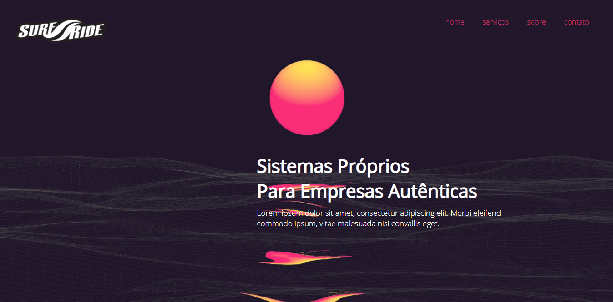

<h4 align="center"> 
	🚧 MinimalistPage 🚀 em construção... 🚧
</h4>

## 💻 Sobre o projeto

 MinimalistPage foi projetado para ser uma landing-page uma pagina com somente uma tela de facil interação que apresenta a empresa em geral. Utilizei somente HTML e CSS já que nesse projeto foi mais um ensinamento, onde oloquei em prática tudo que aprendi sobre HTML e CSS é simples porem me agregou de mais.

## 🎨 Layout

## 📝 Licença

Este projeto esta sobe a licença MIT.
